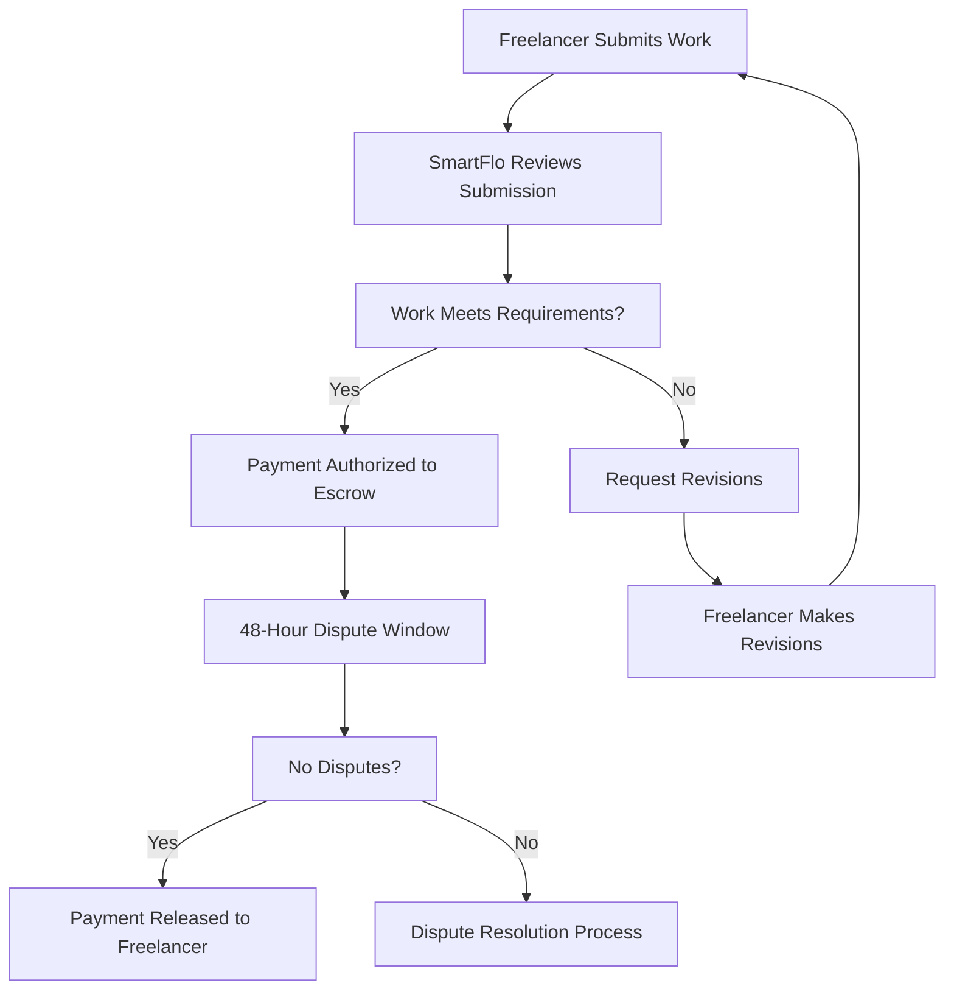

# Payment Authorization User Guide
## How SmartFlo's Automated Payment System Works

### Table of Contents
1. [What is Payment Authorization?](#what-is-payment-authorization)
2. [How It Works](#how-it-works)
3. [Setting Up Payment Authorization](#setting-up-payment-authorization)
4. [Managing Your Authorizations](#managing-your-authorizations)
5. [Security and Protection](#security-and-protection)
6. [Troubleshooting](#troubleshooting)
7. [FAQ](#faq)

---

## What is Payment Authorization?

Payment authorization on SmartFlo allows clients to pre-approve payments for freelance contracts, enabling automatic and secure milestone payments without requiring manual approval for each transaction.

### Key Benefits
- **Faster Payments**: Automatic milestone payments upon completion
- **Secure Escrow**: Your funds are protected in secure escrow accounts
- **Complete Control**: Set limits and revoke authorization anytime
- **Transparent Process**: Full visibility into all transactions
- **Dispute Protection**: 48-hour dispute window for quality assurance

### How It's Different
Unlike traditional payment systems where you pay upfront, SmartFlo's authorization system:
- ✅ Only charges when work is completed and approved
- ✅ Protects your payment method without storing card details
- ✅ Gives you full control over spending limits
- ✅ Provides instant dispute resolution if needed

---

## How It Works

### The Authorization Process

#### Step 1: Contract Creation
When a freelancer sends you a contract, you'll see the project details including:
- **Total Project Cost**: The complete amount for all work
- **Milestone Breakdown**: Individual payment amounts and deliverables
- **Payment Schedule**: When payments will be processed

#### Step 2: Payment Method Setup
Choose your preferred payment method:
- **Credit/Debit Cards**: Visa, Mastercard, American Express
- **Bank Transfer (ACH)**: Direct bank account payments
- **Cryptocurrency**: USDC payments via Solana blockchain

#### Step 3: Authorization Limits
Set your payment controls:
- **Maximum Per Milestone**: Highest amount for any single payment
- **Total Authorization**: Maximum amount for the entire project
- **Revocation Rights**: Ability to cancel authorization anytime

#### Step 4: Secure Verification
Complete the secure setup process:
- **Payment Method Verification**: Confirm your payment method
- **Identity Verification**: Secure authentication process
- **Terms Agreement**: Review and accept payment terms

### Automatic Payment Flow



---

## Setting Up Payment Authorization

### For First-Time Users

#### 1. Account Creation
- Sign up with your email address
- Verify your email and set a strong password
- Complete basic profile information

#### 2. Identity Verification
- Upload government-issued ID
- Verify your phone number
- Complete address verification

#### 3. Payment Method Addition
- Add your preferred payment method
- Complete verification process
- Set as default payment method

### Authorization Setup Process

#### Step 1: Review Contract Details
When you receive a contract invitation:
```
✅ Review project scope and deliverables
✅ Check milestone breakdown and amounts  
✅ Verify freelancer credentials and reviews
✅ Confirm timeline and deadlines
```

#### Step 2: Configure Payment Limits
Set your authorization parameters:
- **Per-Milestone Limit**: Maximum amount for any single payment
- **Total Project Limit**: Maximum amount for entire contract
- **Currency Selection**: USD, USDC, or other supported currencies

#### Step 3: Payment Method Selection
Choose and verify your payment method:
- **Card Payments**: Instant verification with small authorization
- **Bank Transfers**: 1-2 business day verification process
- **Crypto Wallets**: Immediate verification via wallet signature

#### Step 4: Security Confirmation
Complete the authorization:
- **Two-Factor Authentication**: SMS or app-based verification
- **Legal Agreement**: Review and accept payment terms
- **Final Confirmation**: Confirm all details and activate

### Multi-Factor Authentication Setup

For high-value authorizations (over $2,500), additional security is required:

#### SMS Verification
- Add and verify your phone number
- Receive OTP codes for milestone approvals
- Backup phone number recommended

#### Authenticator App Setup
- Download Google Authenticator or similar app
- Scan QR code to link your account
- Test authentication before activation

#### Backup Codes
- Generate and securely store backup codes
- Use if primary authentication is unavailable
- Request new codes if compromised

---

## Managing Your Authorizations

### Authorization Dashboard

Access your authorization management from the client dashboard:

#### Active Authorizations
View all current payment authorizations:
- **Contract Name**: Project title and description
- **Freelancer**: Name and contact information
- **Authorized Amount**: Current spending limit
- **Used Amount**: Amount already paid
- **Remaining Limit**: Available authorization balance
- **Status**: Active, paused, or revoked

#### Recent Transactions
Monitor all payment activity:
- **Date/Time**: When the payment was processed
- **Amount**: Payment amount and fees
- **Milestone**: Which deliverable was paid for
- **Status**: Completed, pending, or disputed
- **Receipt**: Download payment confirmation

### Modifying Authorizations

#### Increasing Limits
To increase authorization amounts:
1. Navigate to the contract page
2. Click "Modify Authorization"
3. Enter new limits (cannot be lower than used amount)
4. Re-authenticate for security
5. Confirm changes

#### Decreasing Limits
To reduce authorization amounts:
1. Ensure new limit is above used amount
2. Request modification through contract page
3. Provide reason for reduction
4. Complete security verification
5. New limits take effect immediately

#### Adding Payment Methods
To add backup payment methods:
1. Go to Payment Methods page
2. Click "Add Payment Method"
3. Choose payment type and complete setup
4. Verify new payment method
5. Set priority order for authorization

### Revocation Process

#### Immediate Revocation
Stop all future payments immediately:
1. Go to contract authorization page
2. Click "Revoke Authorization"
3. Select "Immediate" revocation
4. Provide reason for revocation
5. Complete security confirmation

⚠️ **Important**: Immediate revocation stops all payments but doesn't affect work already completed.

#### Scheduled Revocation
Set future revocation date:
1. Choose "Scheduled Revocation"
2. Select effective date
3. Optionally notify freelancer
4. Set final payment limits
5. Confirm scheduled revocation

#### Partial Revocation
Reduce authorization without full cancellation:
1. Select "Modify Authorization"
2. Reduce total or per-milestone limits
3. Provide business justification
4. Complete authentication
5. Changes take effect immediately

---

## Security and Protection

### Payment Security Features

#### Tokenization
- **Card Details**: Never stored on SmartFlo servers
- **Payment Tokens**: Secure tokens used for processing
- **PCI Compliance**: Highest level security standards
- **Encryption**: All data encrypted in transit and at rest

#### Fraud Protection
- **Real-time Monitoring**: AI-powered fraud detection
- **Geographic Verification**: Location-based security checks
- **Device Recognition**: Known device authentication
- **Velocity Limits**: Protection against rapid-fire attempts

#### Dispute Protection
- **48-Hour Window**: Time to review and dispute payments
- **Evidence Upload**: Submit proof for dispute resolution
- **Fair Resolution**: Neutral third-party mediation
- **Full Refunds**: Complete refund for valid disputes

### Authorization Security

#### Access Controls
- **Multi-Factor Authentication**: Required for high-value transactions
- **IP Address Monitoring**: Alerts for unusual login locations
- **Session Management**: Automatic timeout for inactive sessions
- **Device Authorization**: Known device registration

#### Monitoring and Alerts
Receive instant notifications for:
- ✅ New authorization requests
- ✅ Payment processing attempts
- ✅ Authorization modifications
- ✅ Security warnings or alerts
- ✅ Dispute notifications

### Emergency Procedures

#### Suspected Fraud
If you suspect fraudulent activity:
1. **Immediate Action**: Revoke all authorizations immediately
2. **Contact Support**: Call emergency support line
3. **Change Passwords**: Update all account passwords
4. **Review Activity**: Check all recent transactions
5. **Report Fraud**: File formal fraud report

#### Compromised Account
If your account is compromised:
1. **Secure Account**: Change password immediately
2. **Revoke Sessions**: End all active sessions
3. **Contact Support**: Report security incident
4. **Review Authorizations**: Check all active authorizations
5. **Monitor Activity**: Watch for unauthorized changes

---

## Troubleshooting

### Common Issues and Solutions

#### Payment Method Declined
**Symptoms**: Authorization fails with "Payment method declined"

**Solutions**:
1. **Check Card Status**: Ensure card is active and not expired
2. **Verify Limits**: Check if transaction exceeds daily/monthly limits
3. **Contact Bank**: Call your bank to approve the transaction
4. **Try Alternative**: Use backup payment method
5. **Update Information**: Ensure billing information is current

#### Authorization Not Working
**Symptoms**: Cannot complete authorization setup

**Solutions**:
1. **Clear Browser Cache**: Clear cookies and cached data
2. **Try Different Browser**: Use Chrome, Firefox, or Safari
3. **Disable Ad Blockers**: Temporarily disable browser extensions
4. **Check Internet**: Ensure stable internet connection
5. **Contact Support**: Get help from customer service

#### Missing Notifications
**Symptoms**: Not receiving email or SMS alerts

**Solutions**:
1. **Check Spam Folder**: Look in junk/spam email folders
2. **Verify Phone Number**: Ensure SMS number is correct
3. **Update Preferences**: Check notification settings
4. **Whitelist Emails**: Add SmartFlo to email whitelist
5. **Test Notifications**: Send test notifications to verify

#### Transaction Delays
**Symptoms**: Payments taking longer than expected

**Solutions**:
1. **Check Status**: Review transaction status on dashboard
2. **Verify Completion**: Ensure milestone was properly submitted
3. **Review Disputes**: Check if payment is under dispute
4. **Bank Processing**: Allow 1-3 business days for bank transfers
5. **Contact Support**: Inquire about specific delays

### Getting Help

#### Self-Service Resources
- **Help Center**: Comprehensive guides and tutorials
- **Video Tutorials**: Step-by-step visual guides
- **FAQ Section**: Answers to common questions
- **Status Page**: Real-time system status updates

#### Customer Support
- **Live Chat**: 24/7 chat support for urgent issues
- **Email Support**: Detailed support within 4 hours
- **Phone Support**: Direct phone support for premium users
- **Screen Sharing**: Remote assistance for complex issues

#### Emergency Support
For critical issues requiring immediate attention:
- **Emergency Hotline**: +1-800-SMARTFLO (24/7)
- **Security Team**: security@smartflo.com
- **Escalation Process**: Automatic escalation for unresolved issues

---

## FAQ

### General Questions

**Q: How long does authorization setup take?**
A: Authorization setup typically takes 2-5 minutes for card payments, 1-2 business days for bank transfers, and is immediate for cryptocurrency wallets.

**Q: Can I authorize multiple contracts at once?**
A: Yes, you can have multiple active authorizations. Each contract has its own separate authorization limits and controls.

**Q: What happens if I exceed my authorization limit?**
A: Payments will be declined if they exceed your set limits. You can increase limits anytime through your dashboard.

**Q: Are there fees for payment authorization?**
A: Authorization setup is free. You only pay standard transaction fees when payments are processed (2.9% + $0.30 for cards).

### Security Questions

**Q: Is my payment information secure?**
A: Yes, we use bank-level security with PCI DSS Level 1 compliance. Your card details are never stored on our servers.

**Q: Can I cancel authorization after setting it up?**
A: Yes, you can revoke authorization anytime. This stops future payments but doesn't affect completed work.

**Q: What if someone gains access to my account?**
A: Immediately change your password, revoke all authorizations, and contact our security team at security@smartflo.com.

**Q: How do you verify my identity?**
A: We use multi-factor authentication, device recognition, and identity verification documents to confirm your identity.

### Payment Questions

**Q: When are payments actually charged?**
A: Payments are only charged when milestones are completed and approved, or after the 48-hour dispute window expires.

**Q: Can I dispute a payment after it's processed?**
A: You have 48 hours after milestone completion to dispute payments. After this window, disputes require formal resolution.

**Q: What if the freelancer doesn't complete the work?**
A: No payment is processed until work is submitted. If work is never submitted, no charges occur.

**Q: How do refunds work?**
A: Refunds are processed through the same payment method used for the original transaction, typically within 3-5 business days.

### Technical Questions

**Q: Which browsers are supported?**
A: We support Chrome 90+, Firefox 88+, Safari 14+, and Edge 90+. Mobile browsers are also supported.

**Q: Can I use the system on mobile devices?**
A: Yes, SmartFlo is fully mobile-responsive and works on iOS and Android devices.

**Q: Do you have a mobile app?**
A: Currently we're web-based, but mobile apps for iOS and Android are planned for 2024.

**Q: What if the website is down?**
A: Check our status page at status.smartflo.com for real-time updates. Critical functions have 99.9% uptime guarantee.

---

## Contact Information

### Customer Support
- **Email**: support@getsmartflo.com
- **Phone**: +1-800-SMARTFLO (762-7835)
- **Live Chat**: Available 24/7 on smartflo.com
- **Help Center**: help.smartflo.com

### Security Issues
- **Security Team**: security@smartflo.com
- **Emergency Hotline**: +1-800-762-7835 (24/7)
- **Incident Reporting**: incidents@smartflo.com

### Business Inquiries
- **Sales**: sales@smartflo.com
- **Partnerships**: partners@smartflo.com
- **Enterprise**: enterprise@smartflo.com

---

**Last Updated**: January 2024  
**Version**: 2.1  
**Next Review**: July 2024